# Star Tracker Report

**2026-09-07** | Total: **86334 stars** | Change: **+16**

> Compared to snapshot from 2026-09-06

## 📈 Star Trend

### By Repository

Individual Repository Charts

#### dockur/windows: 53181 ★ (+9)

#### dockur/macos: 21516 ★ (+1)

#### vdsm/virtual-dsm: 3980 ★ (0)

#### dockur/windows-arm: 2250 ★ (+1)

#### qemus/qemu: 2122 ★ (0)

#### dockur/samba: 799 ★ (+1)

#### dockur/umbrel: 410 ★ (0)

#### dockur/proxmox: 305 ★ (0)

#### dockur/casa: 220 ★ (0)

#### dockur/tor: 218 ★ (0)

#### qemus/qemu-arm: 210 ★ (0)

#### dockur/dnsmasq: 160 ★ (0)

#### dockur/portainer-backup: 136 ★ (0)

#### qemus/virtiso: 131 ★ (0)

#### dockur/chrony: 117 ★ (+1)

#### dockur/statping: 76 ★ (0)

#### qemus/virtiso-whql: 65 ★ (+1)

#### dockur/munin: 45 ★ (0)

#### dockur/proxmox-backup: 30 ★ (0)

#### dockur/zima: 29 ★ (0)

#### qemus/qemu-host: 29 ★ (0)

#### qemus/virtiso-arm: 28 ★ (0)

#### dockur/strfry: 23 ★ (0)

#### dockur/lemmy-ui: 22 ★ (0)

#### action-pack/gitlab-sync: 19 ★ (0)

#### qemus/virtiso-x86: 18 ★ (0)

#### dockur/proxmox-dm: 17 ★ (0)

#### dockur/stunnel: 17 ★ (0)

#### dobtc/bitcoin: 13 ★ (0)

#### dockur/lemmy: 13 ★ (0)

#### dockur/chromeos: 11 ★ (0)

#### qemus/passt: 11 ★ (0)

#### qemus/proxmox-backup-arm64: 10 ★ (0)

#### action-pack/increment: 9 ★ (0)

#### dockur/qemu: 9 ★ (0)

#### dockur/virtual-dsm: 9 ★ (0)

#### action-pack/cancel: 8 ★ (0)

#### dockur/proxmox-mail: 8 ★ (0)

#### action-pack/set-secret: 7 ★ (0)

#### dockur/piefed: 6 ★ (0)

#### qemus/proxmox-datacenter-arm64: 5 ★ (0)

#### action-pack/valid-xml: 3 ★ (0)

#### dockur/mdns: 3 ★ (0)

#### qemus/proxmox: 3 ★ (0)

#### qemus/qemu-vmvga: 3 ★ (0)

#### action-pack/set-variable: 2 ★ (0)

#### action-pack/tag-exists: 2 ★ (0)

#### dockur/bitcoin: 2 ★ (0)

#### qemus/fiano: 2 ★ (0)

#### qemus/proxmox-mail-arm64: 2 ★ (0)

#### qemus/qemouse: 2 ★ (0)

#### qemus/qemu-macos: 2 ★ (0)

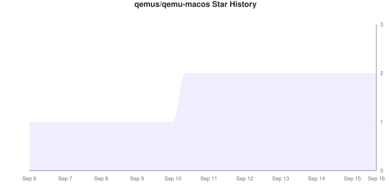

#### qemus/virtio-d3d11: 2 ★ (0)

#### qemus/virtio-drivers-windows: 2 ★ (0)

#### action-pack/bump: 1 ★ (0)

#### action-pack/github-release: 1 ★ (0)

#### action-pack/send-mail: 1 ★ (0)

#### dobtc/btc-rpc-proxy: 1 ★ (0)

#### qemus/boot-logo: 1 ★ (0)

#### qemus/qemu-bochs: 1 ★ (0)

#### qemus/qemu-helios: 1 ★ (0)

#### qemus/qemu-render: 1 ★ (0)

#### qemus/qemu-windows: 1 ★ (0)

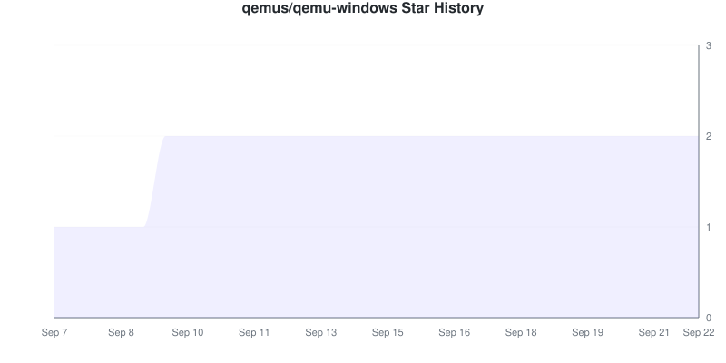

#### qemus/udfread: 1 ★ (0)

#### qemus/virtio-drivers: 1 ★ (0)

#### qemus/websocketd: 1 ★ (0)

## Repositories

| Repositories | Stars | Change | Trend |
|:-----------|------:|-------:|:-----:|
| [dockur/windows](https://github.com/dockur/windows) | 53181 | +9 | ⬆️ |
| [dockur/macos](https://github.com/dockur/macos) | 21516 | +1 | ⬆️ |
| [vdsm/virtual-dsm](https://github.com/vdsm/virtual-dsm) | 3980 | 0 | ➖ |
| [dockur/windows-arm](https://github.com/dockur/windows-arm) | 2250 | +1 | ⬆️ |
| [qemus/qemu](https://github.com/qemus/qemu) | 2122 | 0 | ➖ |
| [dockur/samba](https://github.com/dockur/samba) | 799 | +1 | ⬆️ |
| [dockur/umbrel](https://github.com/dockur/umbrel) | 410 | 0 | ➖ |
| [dockur/proxmox](https://github.com/dockur/proxmox) | 305 | 0 | ➖ |
| [dockur/casa](https://github.com/dockur/casa) | 220 | 0 | ➖ |
| [dockur/tor](https://github.com/dockur/tor) | 218 | 0 | ➖ |
| [qemus/qemu-arm](https://github.com/qemus/qemu-arm) | 210 | 0 | ➖ |
| [dockur/dnsmasq](https://github.com/dockur/dnsmasq) | 160 | 0 | ➖ |
| [dockur/portainer-backup](https://github.com/dockur/portainer-backup) | 136 | 0 | ➖ |
| [qemus/virtiso](https://github.com/qemus/virtiso) | 131 | 0 | ➖ |
| [dockur/chrony](https://github.com/dockur/chrony) | 117 | +1 | ⬆️ |
| [dockur/statping](https://github.com/dockur/statping) | 76 | 0 | ➖ |
| [qemus/virtiso-whql](https://github.com/qemus/virtiso-whql) | 65 | +1 | ⬆️ |
| [dockur/munin](https://github.com/dockur/munin) | 45 | 0 | ➖ |
| [dockur/proxmox-backup](https://github.com/dockur/proxmox-backup) | 30 | 0 | ➖ |
| [dockur/zima](https://github.com/dockur/zima) | 29 | 0 | ➖ |
| [qemus/qemu-host](https://github.com/qemus/qemu-host) | 29 | 0 | ➖ |
| [qemus/virtiso-arm](https://github.com/qemus/virtiso-arm) | 28 | 0 | ➖ |
| [dockur/strfry](https://github.com/dockur/strfry) | 23 | 0 | ➖ |
| [dockur/lemmy-ui](https://github.com/dockur/lemmy-ui) | 22 | 0 | ➖ |
| [action-pack/gitlab-sync](https://github.com/action-pack/gitlab-sync) | 19 | 0 | ➖ |
| [qemus/virtiso-x86](https://github.com/qemus/virtiso-x86) | 18 | 0 | ➖ |
| [dockur/proxmox-dm](https://github.com/dockur/proxmox-dm) | 17 | 0 | ➖ |
| [dockur/stunnel](https://github.com/dockur/stunnel) | 17 | 0 | ➖ |
| [dobtc/bitcoin](https://github.com/dobtc/bitcoin) | 13 | 0 | ➖ |
| [dockur/lemmy](https://github.com/dockur/lemmy) | 13 | 0 | ➖ |
| [dockur/chromeos](https://github.com/dockur/chromeos) | 11 | 0 | ➖ |
| [qemus/passt](https://github.com/qemus/passt) | 11 | 0 | ➖ |
| [qemus/proxmox-backup-arm64](https://github.com/qemus/proxmox-backup-arm64) | 10 | 0 | ➖ |
| [action-pack/increment](https://github.com/action-pack/increment) | 9 | 0 | ➖ |
| [dockur/qemu](https://github.com/dockur/qemu) | 9 | 0 | ➖ |
| [dockur/virtual-dsm](https://github.com/dockur/virtual-dsm) | 9 | 0 | ➖ |
| [action-pack/cancel](https://github.com/action-pack/cancel) | 8 | 0 | ➖ |
| [dockur/proxmox-mail](https://github.com/dockur/proxmox-mail) | 8 | 0 | ➖ |
| [action-pack/set-secret](https://github.com/action-pack/set-secret) | 7 | 0 | ➖ |
| [dockur/piefed](https://github.com/dockur/piefed) | 6 | 0 | ➖ |
| [qemus/proxmox-datacenter-arm64](https://github.com/qemus/proxmox-datacenter-arm64) | 5 | 0 | ➖ |
| [action-pack/valid-xml](https://github.com/action-pack/valid-xml) | 3 | 0 | ➖ |
| [dockur/mdns](https://github.com/dockur/mdns) | 3 | 0 | ➖ |
| [qemus/proxmox](https://github.com/qemus/proxmox) | 3 | 0 | ➖ |
| [qemus/qemu-vmvga](https://github.com/qemus/qemu-vmvga) | 3 | 0 | ➖ |
| [action-pack/set-variable](https://github.com/action-pack/set-variable) | 2 | 0 | ➖ |
| [action-pack/tag-exists](https://github.com/action-pack/tag-exists) | 2 | 0 | ➖ |
| [dockur/bitcoin](https://github.com/dockur/bitcoin) | 2 | 0 | ➖ |
| [qemus/fiano](https://github.com/qemus/fiano) | 2 | 0 | ➖ |
| [qemus/proxmox-mail-arm64](https://github.com/qemus/proxmox-mail-arm64) | 2 | 0 | ➖ |
| [qemus/qemouse](https://github.com/qemus/qemouse) | 2 | 0 | ➖ |
| [qemus/qemu-macos](https://github.com/qemus/qemu-macos) `NEW` | 2 | 0 | ➖ |
| [qemus/virtio-d3d11](https://github.com/qemus/virtio-d3d11) | 2 | 0 | ➖ |
| [qemus/virtio-drivers-windows](https://github.com/qemus/virtio-drivers-windows) | 2 | 0 | ➖ |
| [action-pack/bump](https://github.com/action-pack/bump) | 1 | 0 | ➖ |
| [action-pack/github-release](https://github.com/action-pack/github-release) | 1 | 0 | ➖ |
| [action-pack/send-mail](https://github.com/action-pack/send-mail) | 1 | 0 | ➖ |
| [dobtc/btc-rpc-proxy](https://github.com/dobtc/btc-rpc-proxy) | 1 | 0 | ➖ |
| [qemus/boot-logo](https://github.com/qemus/boot-logo) | 1 | 0 | ➖ |
| [qemus/qemu-bochs](https://github.com/qemus/qemu-bochs) | 1 | 0 | ➖ |
| [qemus/qemu-helios](https://github.com/qemus/qemu-helios) | 1 | 0 | ➖ |
| [qemus/qemu-render](https://github.com/qemus/qemu-render) | 1 | 0 | ➖ |
| [qemus/qemu-windows](https://github.com/qemus/qemu-windows) `NEW` | 1 | 0 | ➖ |
| [qemus/udfread](https://github.com/qemus/udfread) | 1 | 0 | ➖ |
| [qemus/virtio-drivers](https://github.com/qemus/virtio-drivers) | 1 | 0 | ➖ |
| [qemus/websocketd](https://github.com/qemus/websocketd) | 1 | 0 | ➖ |

## New Repositories

- [qemus/qemu-macos](https://github.com/qemus/qemu-macos): 2 stars
- [qemus/qemu-windows](https://github.com/qemus/qemu-windows): 1 stars

## Removed Repositories

qemus/qemu-reims: was 1 stars

## Summary

- **Stars gained:** 14
- **Stars lost:** 1
- **Net change:** +16

## 🔮 Growth Forecast

### 🚀 Growth Velocity

- **Stars per day:** 16.02
- **Growth:** +0%
- ~854 days to 100000 ★

**Aggregate Forecast**

| Method | Week 1 | Week 2 | Week 3 | Week 4 |
|:---|---:|---:|---:|---:|
| Linear Regression | 86895 | 87457 | 88018 | 88579 |
| Weighted Moving Average | 86872 | 87409 | 87947 | 88485 |

### By Repository

dockur/windows

**dockur/windows**

| Method | Week 1 | Week 2 | Week 3 | Week 4 |
|:---|---:|---:|---:|---:|
| Linear Regression | 53551 | 53921 | 54291 | 54661 |
| Weighted Moving Average | 53498 | 53814 | 54131 | 54447 |

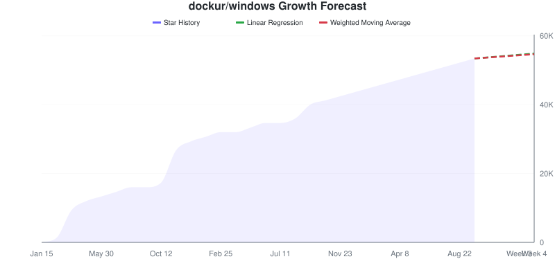

dockur/macos

**dockur/macos**

| Method | Week 1 | Week 2 | Week 3 | Week 4 |
|:---|---:|---:|---:|---:|
| Linear Regression | 21709 | 21901 | 22094 | 22287 |
| Weighted Moving Average | 21663 | 21810 | 21958 | 22105 |

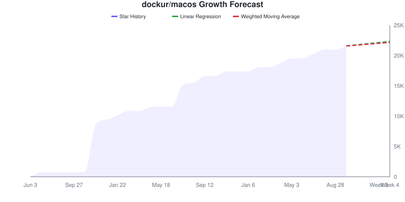

vdsm/virtual-dsm

**vdsm/virtual-dsm**

| Method | Week 1 | Week 2 | Week 3 | Week 4 |
|:---|---:|---:|---:|---:|
| Linear Regression | 4001 | 4022 | 4043 | 4063 |
| Weighted Moving Average | 3997 | 4015 | 4032 | 4049 |

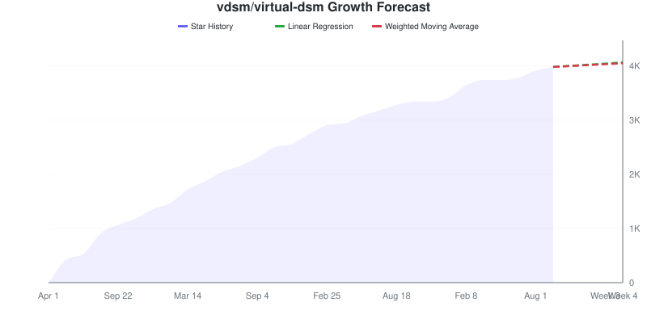

dockur/windows-arm

**dockur/windows-arm**

| Method | Week 1 | Week 2 | Week 3 | Week 4 |
|:---|---:|---:|---:|---:|
| Linear Regression | 2266 | 2283 | 2299 | 2315 |
| Weighted Moving Average | 2263 | 2275 | 2288 | 2301 |

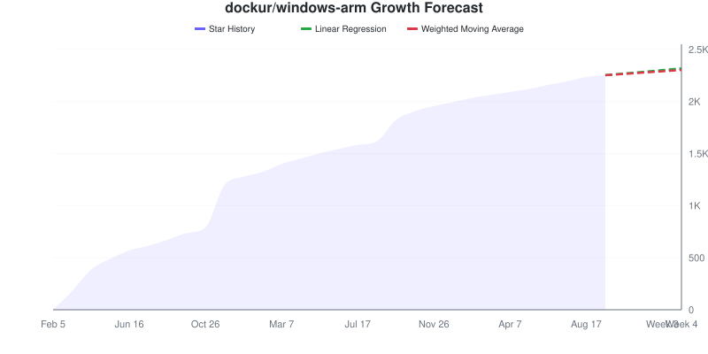

qemus/qemu

**qemus/qemu**

| Method | Week 1 | Week 2 | Week 3 | Week 4 |
|:---|---:|---:|---:|---:|
| Linear Regression | 2135 | 2147 | 2160 | 2173 |
| Weighted Moving Average | 2138 | 2154 | 2169 | 2185 |

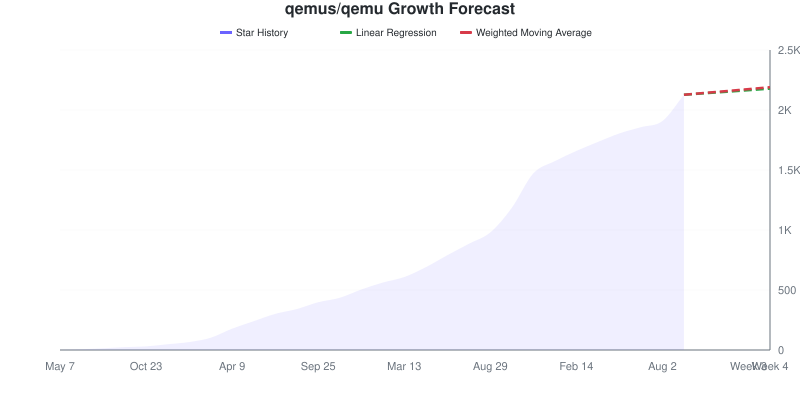

dockur/samba

**dockur/samba**

| Method | Week 1 | Week 2 | Week 3 | Week 4 |
|:---|---:|---:|---:|---:|
| Linear Regression | 805 | 812 | 818 | 825 |
| Weighted Moving Average | 806 | 812 | 819 | 825 |

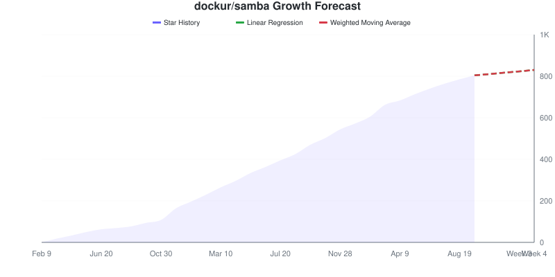

dockur/umbrel

**dockur/umbrel**

| Method | Week 1 | Week 2 | Week 3 | Week 4 |
|:---|---:|---:|---:|---:|
| Linear Regression | 414 | 417 | 421 | 425 |
| Weighted Moving Average | 413 | 416 | 419 | 422 |

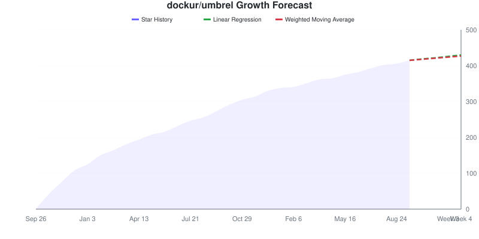

dockur/proxmox

**dockur/proxmox**

| Method | Week 1 | Week 2 | Week 3 | Week 4 |
|:---|---:|---:|---:|---:|
| Linear Regression | 316 | 328 | 339 | 351 |
| Weighted Moving Average | 313 | 320 | 328 | 336 |

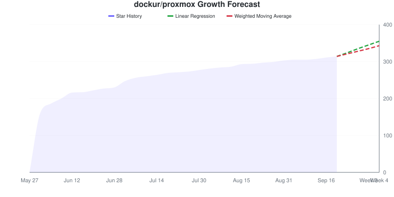

dockur/casa

**dockur/casa**

| Method | Week 1 | Week 2 | Week 3 | Week 4 |
|:---|---:|---:|---:|---:|
| Linear Regression | 222 | 225 | 227 | 230 |
| Weighted Moving Average | 222 | 224 | 226 | 228 |

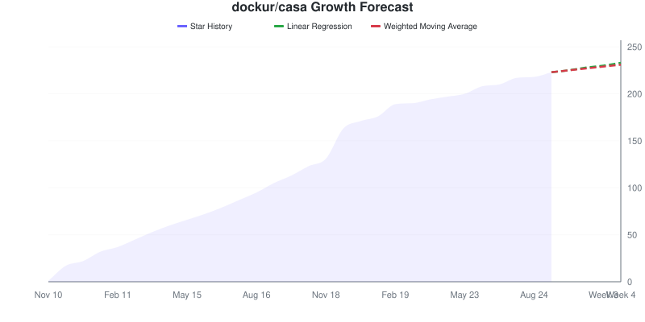

dockur/tor

**dockur/tor**

| Method | Week 1 | Week 2 | Week 3 | Week 4 |
|:---|---:|---:|---:|---:|
| Linear Regression | 220 | 221 | 223 | 225 |
| Weighted Moving Average | 220 | 221 | 223 | 225 |

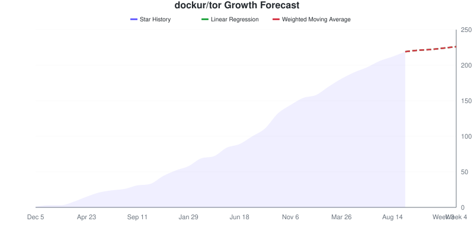

qemus/qemu-arm

**qemus/qemu-arm**

| Method | Week 1 | Week 2 | Week 3 | Week 4 |
|:---|---:|---:|---:|---:|
| Linear Regression | 212 | 213 | 215 | 217 |
| Weighted Moving Average | 212 | 213 | 215 | 216 |

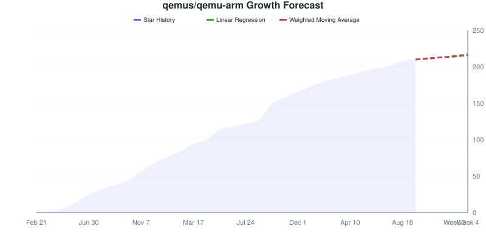

dockur/dnsmasq

**dockur/dnsmasq**

| Method | Week 1 | Week 2 | Week 3 | Week 4 |
|:---|---:|---:|---:|---:|
| Linear Regression | 161 | 163 | 164 | 165 |
| Weighted Moving Average | 161 | 163 | 164 | 165 |

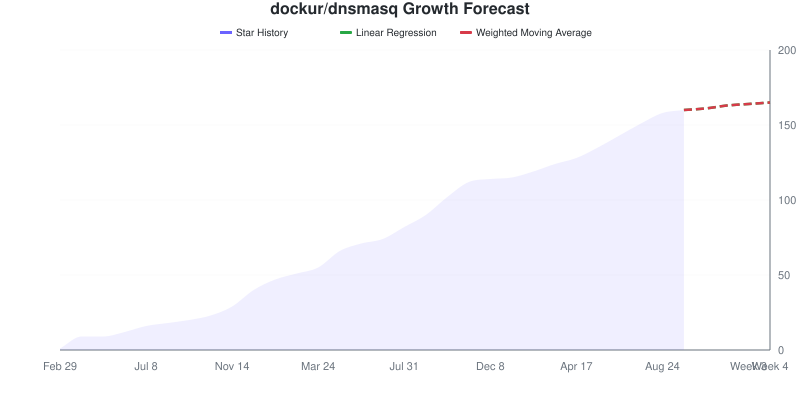

dockur/portainer-backup

**dockur/portainer-backup**

| Method | Week 1 | Week 2 | Week 3 | Week 4 |
|:---|---:|---:|---:|---:|
| Linear Regression | 137 | 138 | 139 | 140 |
| Weighted Moving Average | 137 | 138 | 139 | 140 |

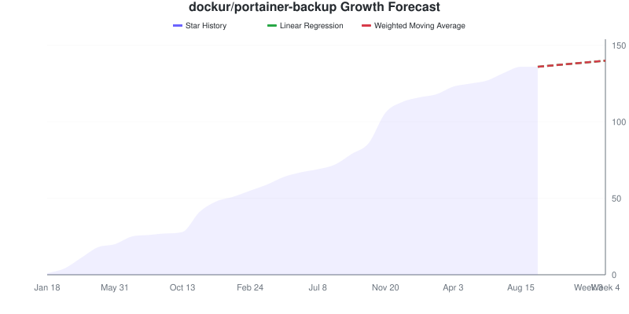

qemus/virtiso

**qemus/virtiso**

| Method | Week 1 | Week 2 | Week 3 | Week 4 |
|:---|---:|---:|---:|---:|
| Linear Regression | 132 | 133 | 134 | 135 |
| Weighted Moving Average | 132 | 133 | 134 | 135 |

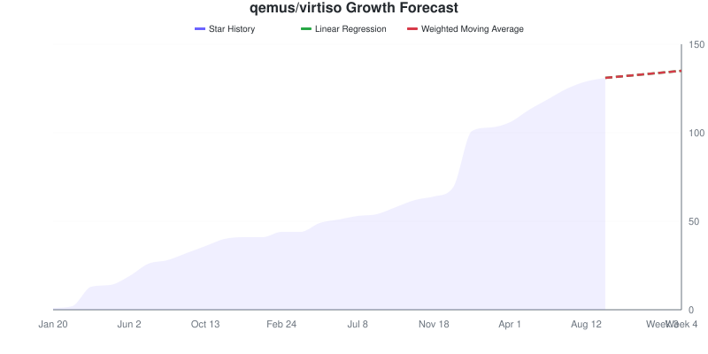

dockur/chrony

**dockur/chrony**

| Method | Week 1 | Week 2 | Week 3 | Week 4 |
|:---|---:|---:|---:|---:|
| Linear Regression | 118 | 119 | 120 | 120 |
| Weighted Moving Average | 118 | 119 | 120 | 121 |

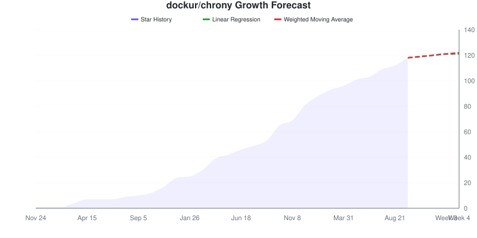

dockur/statping

**dockur/statping**

| Method | Week 1 | Week 2 | Week 3 | Week 4 |
|:---|---:|---:|---:|---:|
| Linear Regression | 77 | 77 | 78 | 78 |
| Weighted Moving Average | 76 | 77 | 77 | 78 |

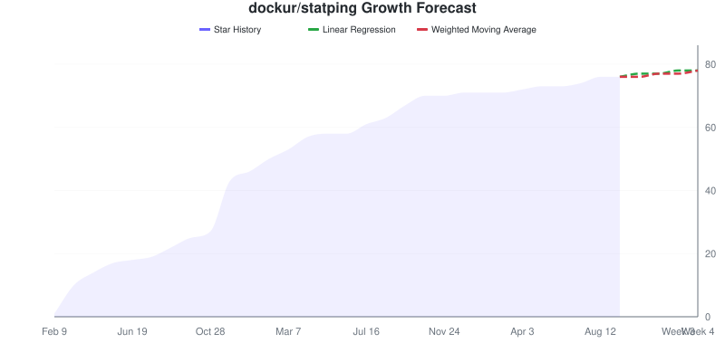

qemus/virtiso-whql

**qemus/virtiso-whql**

| Method | Week 1 | Week 2 | Week 3 | Week 4 |
|:---|---:|---:|---:|---:|
| Linear Regression | 66 | 66 | 67 | 68 |
| Weighted Moving Average | 66 | 66 | 67 | 68 |

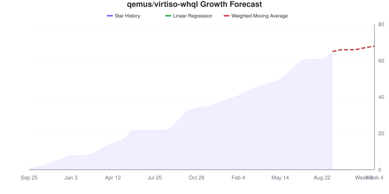

dockur/munin

**dockur/munin**

| Method | Week 1 | Week 2 | Week 3 | Week 4 |
|:---|---:|---:|---:|---:|
| Linear Regression | 45 | 46 | 46 | 46 |
| Weighted Moving Average | 45 | 46 | 46 | 46 |

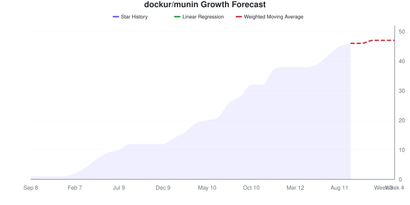

dockur/proxmox-backup

**dockur/proxmox-backup**

| Method | Week 1 | Week 2 | Week 3 | Week 4 |
|:---|---:|---:|---:|---:|
| Linear Regression | 33 | 35 | 38 | 41 |
| Weighted Moving Average | 32 | 34 | 36 | 38 |

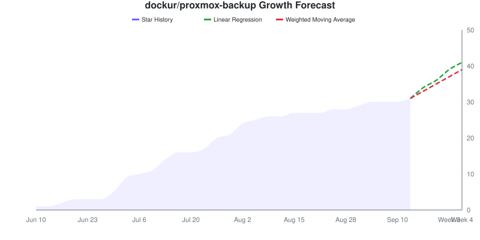

dockur/zima

**dockur/zima**

| Method | Week 1 | Week 2 | Week 3 | Week 4 |
|:---|---:|---:|---:|---:|
| Linear Regression | 31 | 32 | 34 | 36 |
| Weighted Moving Average | 30 | 31 | 32 | 33 |

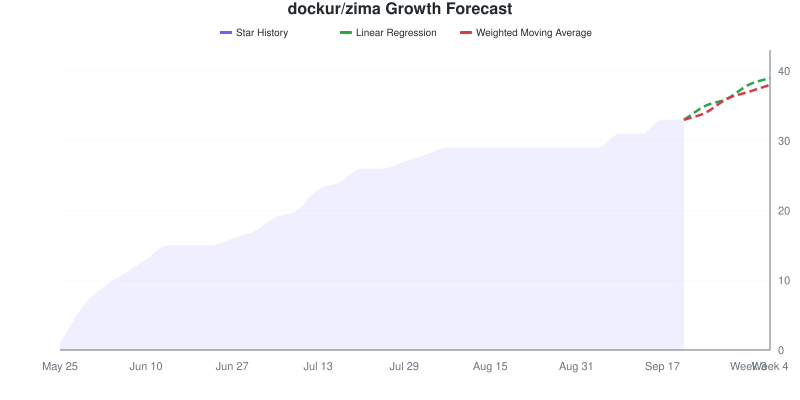

qemus/qemu-host

**qemus/qemu-host**

| Method | Week 1 | Week 2 | Week 3 | Week 4 |
|:---|---:|---:|---:|---:|
| Linear Regression | 29 | 29 | 30 | 30 |
| Weighted Moving Average | 29 | 29 | 29 | 30 |

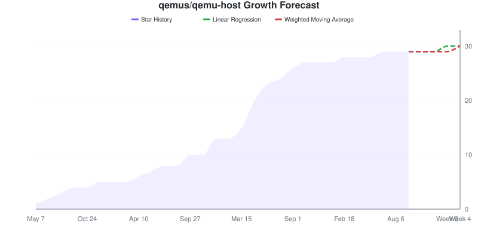

qemus/virtiso-arm

**qemus/virtiso-arm**

| Method | Week 1 | Week 2 | Week 3 | Week 4 |
|:---|---:|---:|---:|---:|
| Linear Regression | 28 | 28 | 29 | 29 |
| Weighted Moving Average | 28 | 29 | 29 | 29 |

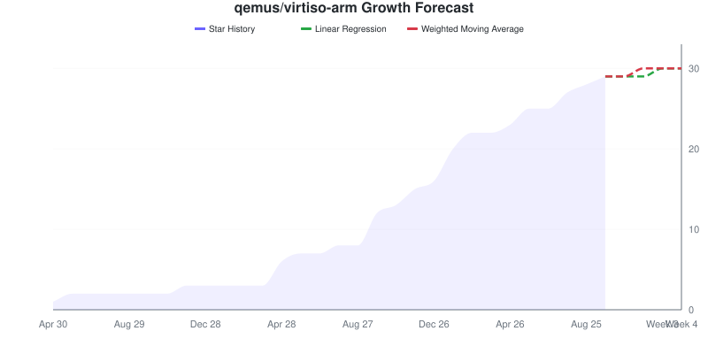

dockur/strfry

**dockur/strfry**

| Method | Week 1 | Week 2 | Week 3 | Week 4 |
|:---|---:|---:|---:|---:|
| Linear Regression | 23 | 23 | 23 | 24 |
| Weighted Moving Average | 23 | 23 | 23 | 24 |

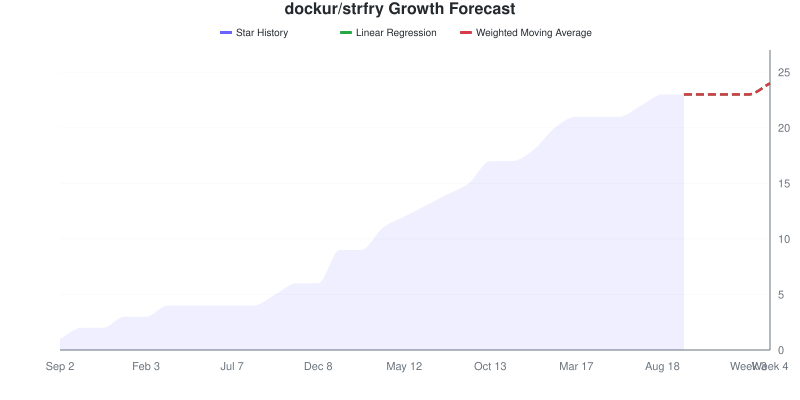

dockur/lemmy-ui

**dockur/lemmy-ui**

| Method | Week 1 | Week 2 | Week 3 | Week 4 |
|:---|---:|---:|---:|---:|
| Linear Regression | 22 | 22 | 23 | 23 |
| Weighted Moving Average | 22 | 22 | 22 | 23 |

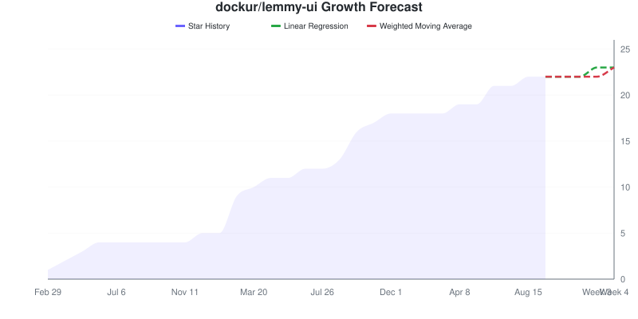

action-pack/gitlab-sync

**action-pack/gitlab-sync**

| Method | Week 1 | Week 2 | Week 3 | Week 4 |
|:---|---:|---:|---:|---:|
| Linear Regression | 19 | 19 | 19 | 19 |
| Weighted Moving Average | 19 | 19 | 19 | 19 |

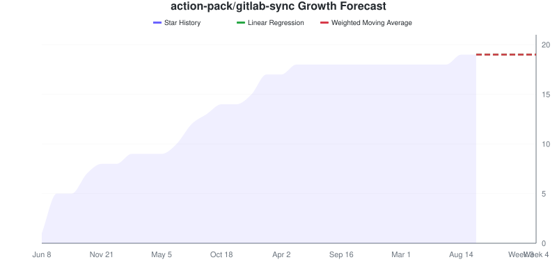

qemus/virtiso-x86

**qemus/virtiso-x86**

| Method | Week 1 | Week 2 | Week 3 | Week 4 |
|:---|---:|---:|---:|---:|
| Linear Regression | 18 | 18 | 18 | 19 |
| Weighted Moving Average | 18 | 18 | 18 | 19 |

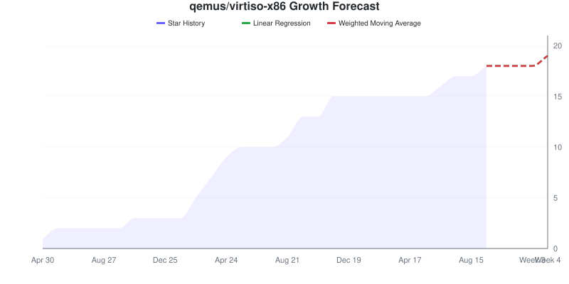

dockur/proxmox-dm

**dockur/proxmox-dm**

| Method | Week 1 | Week 2 | Week 3 | Week 4 |
|:---|---:|---:|---:|---:|
| Linear Regression | 18 | 20 | 21 | 23 |
| Weighted Moving Average | 18 | 19 | 20 | 22 |

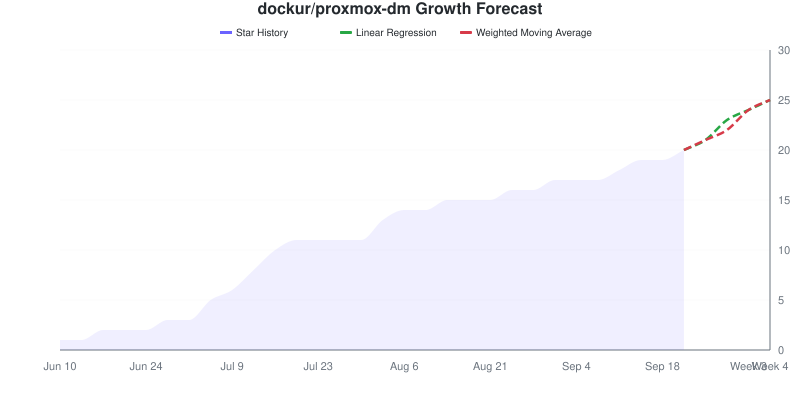

dockur/stunnel

**dockur/stunnel**

| Method | Week 1 | Week 2 | Week 3 | Week 4 |
|:---|---:|---:|---:|---:|
| Linear Regression | 17 | 18 | 18 | 18 |
| Weighted Moving Average | 17 | 18 | 18 | 18 |

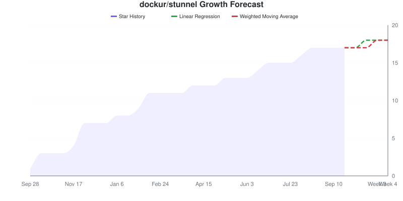

dobtc/bitcoin

**dobtc/bitcoin**

| Method | Week 1 | Week 2 | Week 3 | Week 4 |
|:---|---:|---:|---:|---:|
| Linear Regression | 13 | 13 | 13 | 13 |
| Weighted Moving Average | 13 | 13 | 13 | 13 |

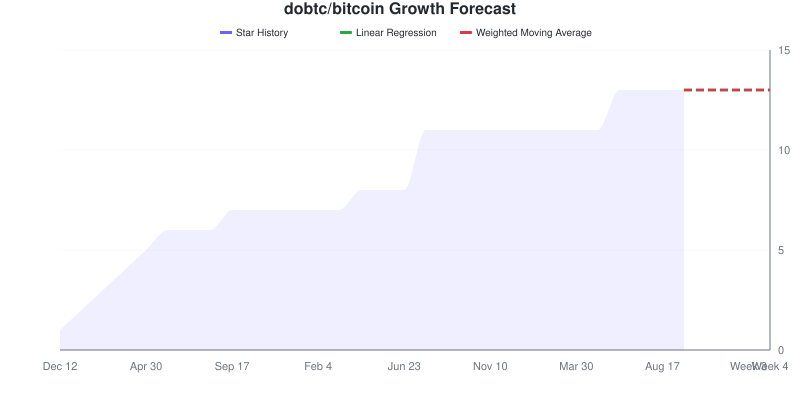

dockur/lemmy

**dockur/lemmy**

| Method | Week 1 | Week 2 | Week 3 | Week 4 |
|:---|---:|---:|---:|---:|
| Linear Regression | 13 | 13 | 13 | 13 |
| Weighted Moving Average | 13 | 13 | 13 | 13 |

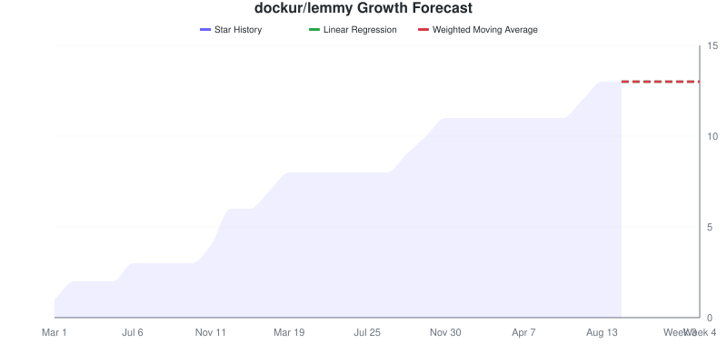

dockur/chromeos

**dockur/chromeos**

| Method | Week 1 | Week 2 | Week 3 | Week 4 |
|:---|---:|---:|---:|---:|
| Linear Regression | 12 | 14 | 15 | 16 |
| Weighted Moving Average | 12 | 14 | 15 | 16 |

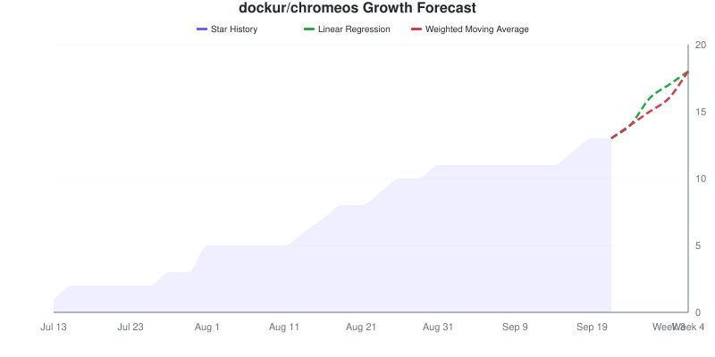

qemus/passt

**qemus/passt**

| Method | Week 1 | Week 2 | Week 3 | Week 4 |
|:---|---:|---:|---:|---:|
| Linear Regression | 11 | 11 | 12 | 12 |
| Weighted Moving Average | 11 | 11 | 12 | 12 |

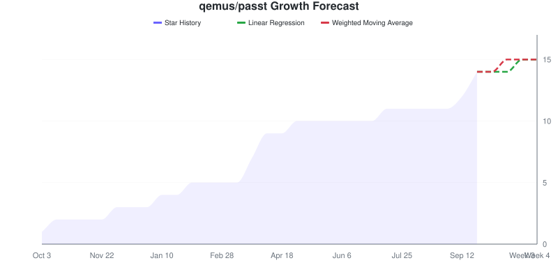

qemus/proxmox-backup-arm64

**qemus/proxmox-backup-arm64**

| Method | Week 1 | Week 2 | Week 3 | Week 4 |
|:---|---:|---:|---:|---:|
| Linear Regression | 10 | 11 | 11 | 12 |
| Weighted Moving Average | 10 | 11 | 11 | 12 |

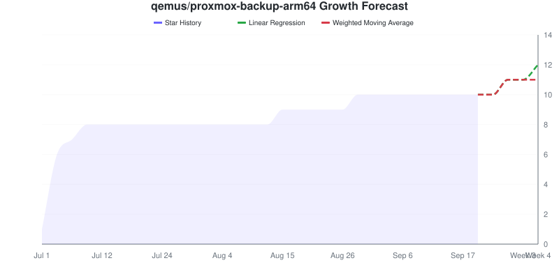

action-pack/increment

**action-pack/increment**

| Method | Week 1 | Week 2 | Week 3 | Week 4 |
|:---|---:|---:|---:|---:|
| Linear Regression | 9 | 9 | 9 | 9 |
| Weighted Moving Average | 9 | 9 | 9 | 9 |

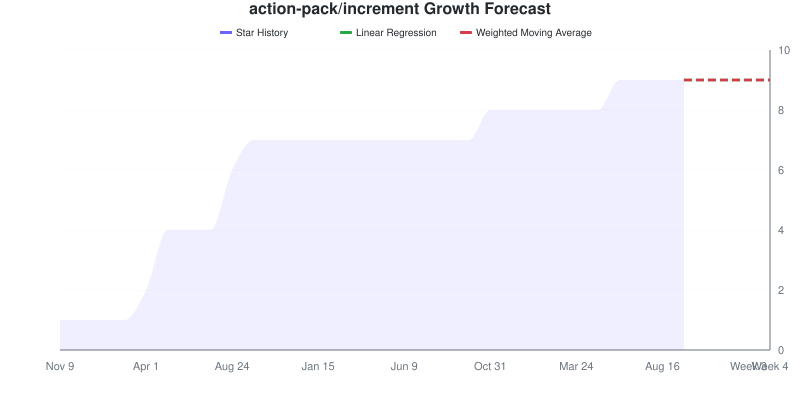

dockur/qemu

**dockur/qemu**

| Method | Week 1 | Week 2 | Week 3 | Week 4 |
|:---|---:|---:|---:|---:|
| Linear Regression | 10 | 11 | 11 | 12 |
| Weighted Moving Average | 10 | 10 | 11 | 11 |

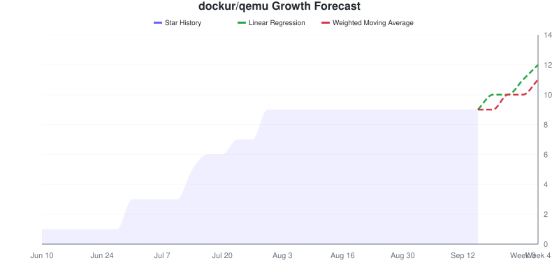

dockur/virtual-dsm

**dockur/virtual-dsm**

| Method | Week 1 | Week 2 | Week 3 | Week 4 |
|:---|---:|---:|---:|---:|
| Linear Regression | 10 | 10 | 11 | 12 |
| Weighted Moving Average | 9 | 10 | 10 | 11 |

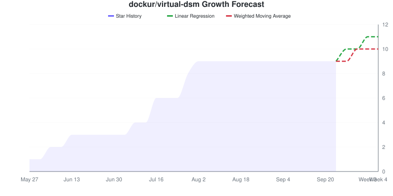

action-pack/cancel

**action-pack/cancel**

| Method | Week 1 | Week 2 | Week 3 | Week 4 |
|:---|---:|---:|---:|---:|
| Linear Regression | 8 | 8 | 8 | 8 |
| Weighted Moving Average | 8 | 8 | 8 | 8 |

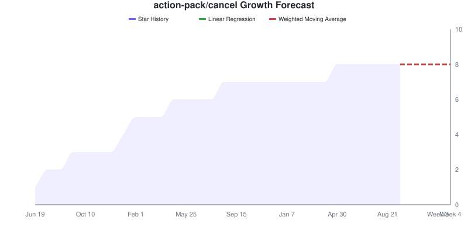

dockur/proxmox-mail

**dockur/proxmox-mail**

| Method | Week 1 | Week 2 | Week 3 | Week 4 |
|:---|---:|---:|---:|---:|
| Linear Regression | 9 | 9 | 10 | 11 |
| Weighted Moving Average | 9 | 9 | 10 | 10 |

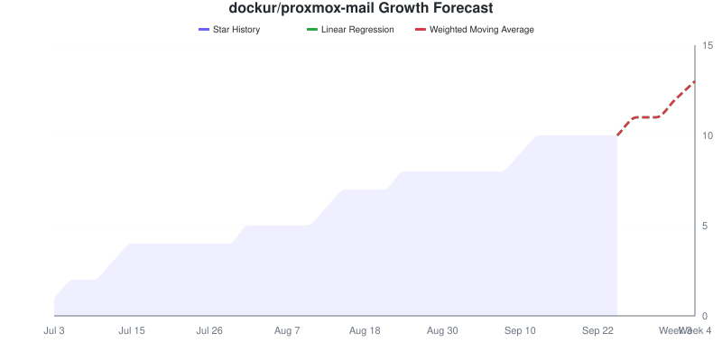

action-pack/set-secret

**action-pack/set-secret**

| Method | Week 1 | Week 2 | Week 3 | Week 4 |
|:---|---:|---:|---:|---:|
| Linear Regression | 7 | 7 | 7 | 7 |
| Weighted Moving Average | 7 | 7 | 7 | 7 |

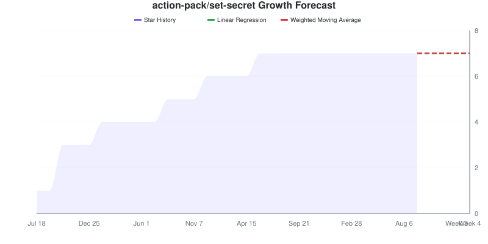

dockur/piefed

**dockur/piefed**

| Method | Week 1 | Week 2 | Week 3 | Week 4 |
|:---|---:|---:|---:|---:|
| Linear Regression | 7 | 7 | 8 | 8 |
| Weighted Moving Average | 6 | 7 | 7 | 8 |

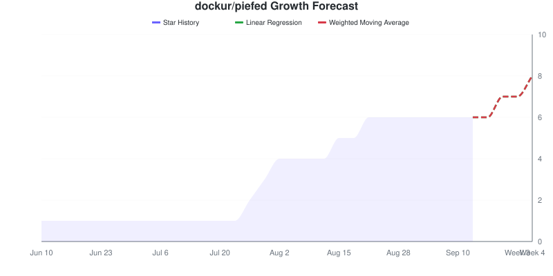

qemus/proxmox-datacenter-arm64

**qemus/proxmox-datacenter-arm64**

| Method | Week 1 | Week 2 | Week 3 | Week 4 |
|:---|---:|---:|---:|---:|
| Linear Regression | 5 | 5 | 6 | 6 |
| Weighted Moving Average | 5 | 5 | 6 | 6 |

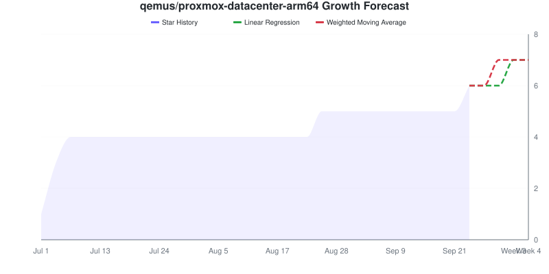

action-pack/valid-xml

**action-pack/valid-xml**

| Method | Week 1 | Week 2 | Week 3 | Week 4 |
|:---|---:|---:|---:|---:|
| Linear Regression | 3 | 3 | 3 | 3 |
| Weighted Moving Average | 3 | 3 | 3 | 3 |

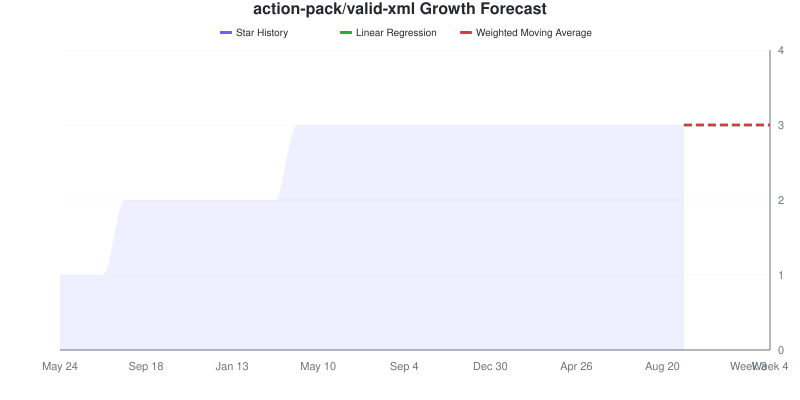

dockur/mdns

**dockur/mdns**

| Method | Week 1 | Week 2 | Week 3 | Week 4 |
|:---|---:|---:|---:|---:|
| Linear Regression | 3 | 4 | 4 | 4 |
| Weighted Moving Average | 3 | 3 | 3 | 4 |

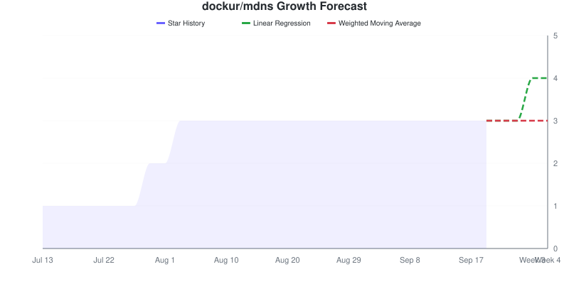

qemus/proxmox

**qemus/proxmox**

| Method | Week 1 | Week 2 | Week 3 | Week 4 |
|:---|---:|---:|---:|---:|
| Linear Regression | 3 | 3 | 3 | 3 |
| Weighted Moving Average | 3 | 3 | 3 | 3 |

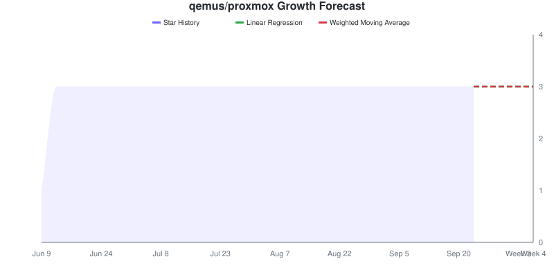

qemus/qemu-vmvga

**qemus/qemu-vmvga**

| Method | Week 1 | Week 2 | Week 3 | Week 4 |
|:---|---:|---:|---:|---:|
| Linear Regression | 6 | 10 | 13 | 16 |
| Weighted Moving Average | 3 | 3 | 3 | 3 |

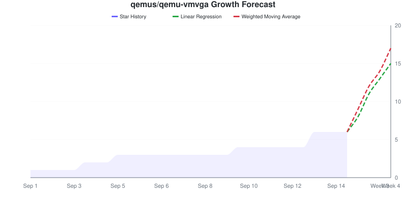

action-pack/set-variable

**action-pack/set-variable**

| Method | Week 1 | Week 2 | Week 3 | Week 4 |
|:---|---:|---:|---:|---:|
| Linear Regression | 2 | 2 | 2 | 2 |
| Weighted Moving Average | 2 | 2 | 2 | 2 |

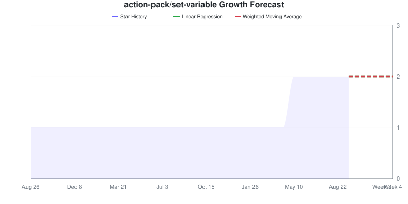

action-pack/tag-exists

**action-pack/tag-exists**

| Method | Week 1 | Week 2 | Week 3 | Week 4 |
|:---|---:|---:|---:|---:|
| Linear Regression | 2 | 2 | 2 | 2 |
| Weighted Moving Average | 2 | 2 | 2 | 2 |

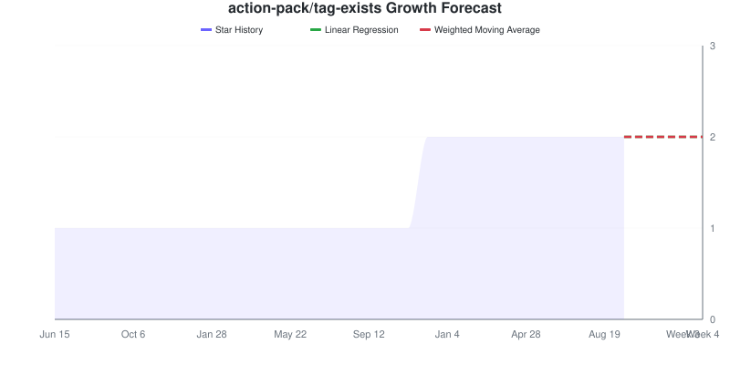

dockur/bitcoin

**dockur/bitcoin**

| Method | Week 1 | Week 2 | Week 3 | Week 4 |
|:---|---:|---:|---:|---:|
| Linear Regression | 2 | 2 | 2 | 2 |
| Weighted Moving Average | 2 | 2 | 2 | 2 |

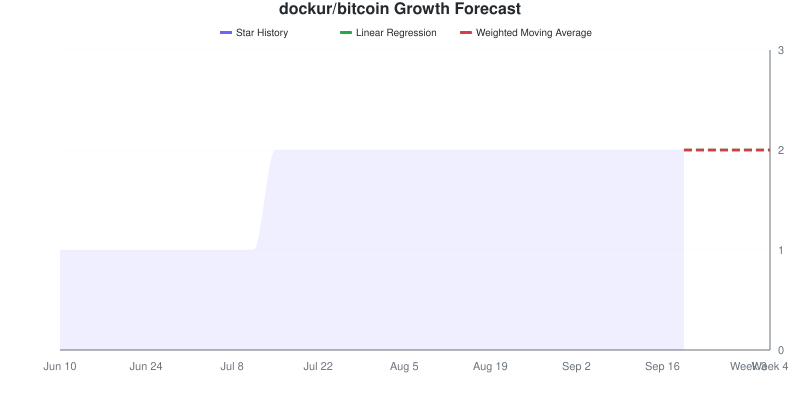

qemus/fiano

**qemus/fiano**

| Method | Week 1 | Week 2 | Week 3 | Week 4 |
|:---|---:|---:|---:|---:|
| Linear Regression | 2 | 2 | 2 | 2 |
| Weighted Moving Average | 2 | 2 | 2 | 2 |

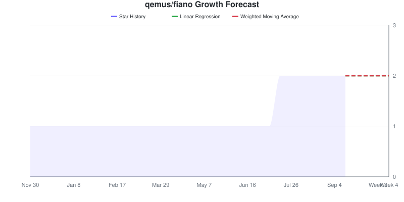

qemus/proxmox-mail-arm64

**qemus/proxmox-mail-arm64**

| Method | Week 1 | Week 2 | Week 3 | Week 4 |
|:---|---:|---:|---:|---:|
| Linear Regression | 2 | 2 | 2 | 2 |
| Weighted Moving Average | 2 | 2 | 2 | 2 |

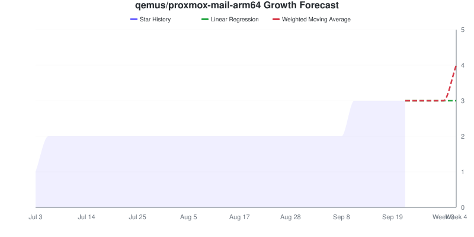

qemus/qemouse

**qemus/qemouse**

| Method | Week 1 | Week 2 | Week 3 | Week 4 |
|:---|---:|---:|---:|---:|
| Linear Regression | 2 | 2 | 2 | 2 |
| Weighted Moving Average | 2 | 2 | 2 | 2 |

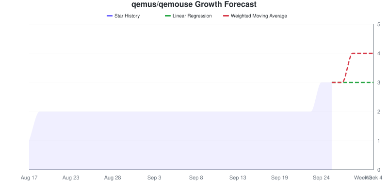

qemus/qemu-macos

**qemus/qemu-macos**

| Method | Week 1 | Week 2 | Week 3 | Week 4 |
|:---|---:|---:|---:|---:|
| Linear Regression | 2 | 2 | 2 | 2 |
| Weighted Moving Average | 3 | 4 | 5 | 6 |

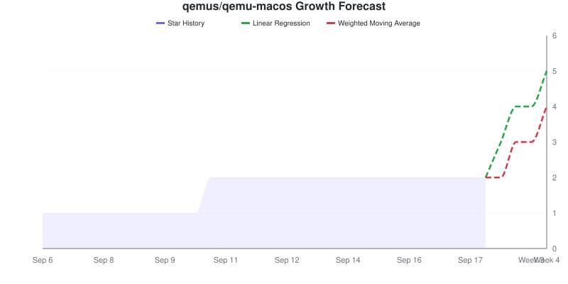

qemus/virtio-d3d11

**qemus/virtio-d3d11**

| Method | Week 1 | Week 2 | Week 3 | Week 4 |
|:---|---:|---:|---:|---:|
| Linear Regression | 4 | 5 | 7 | 8 |
| Weighted Moving Average | 2 | 2 | 2 | 2 |

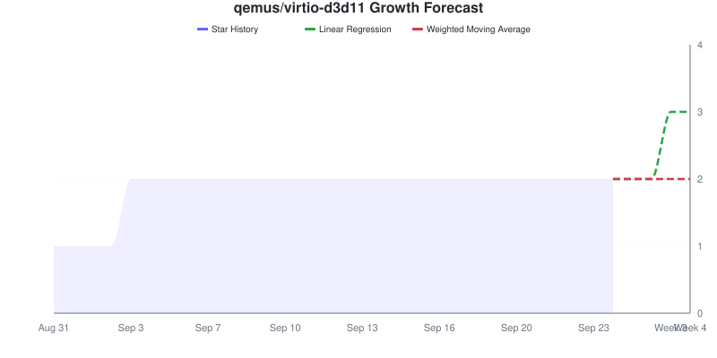

qemus/virtio-drivers-windows

**qemus/virtio-drivers-windows**

| Method | Week 1 | Week 2 | Week 3 | Week 4 |
|:---|---:|---:|---:|---:|
| Linear Regression | 4 | 5 | 7 | 8 |
| Weighted Moving Average | 2 | 2 | 2 | 2 |

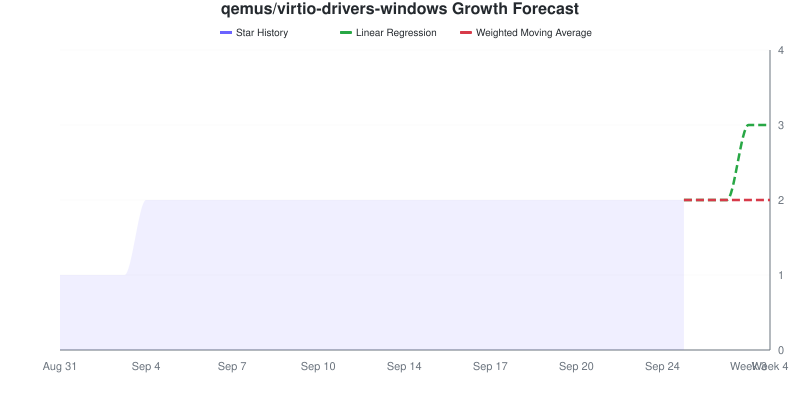

action-pack/bump

**action-pack/bump**

| Method | Week 1 | Week 2 | Week 3 | Week 4 |
|:---|---:|---:|---:|---:|
| Linear Regression | 1 | 1 | 1 | 1 |
| Weighted Moving Average | 1 | 1 | 1 | 1 |

action-pack/github-release

**action-pack/github-release**

| Method | Week 1 | Week 2 | Week 3 | Week 4 |
|:---|---:|---:|---:|---:|
| Linear Regression | 1 | 1 | 1 | 1 |
| Weighted Moving Average | 1 | 1 | 1 | 1 |

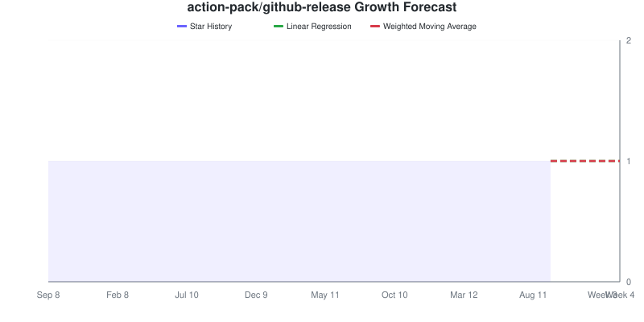

action-pack/send-mail

**action-pack/send-mail**

| Method | Week 1 | Week 2 | Week 3 | Week 4 |
|:---|---:|---:|---:|---:|
| Linear Regression | 1 | 1 | 1 | 1 |
| Weighted Moving Average | 1 | 1 | 1 | 1 |

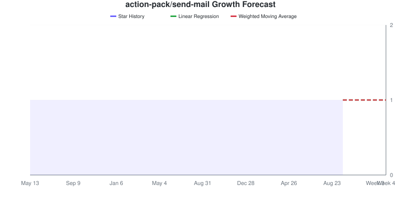

dobtc/btc-rpc-proxy

**dobtc/btc-rpc-proxy**

| Method | Week 1 | Week 2 | Week 3 | Week 4 |
|:---|---:|---:|---:|---:|
| Linear Regression | 1 | 1 | 1 | 1 |
| Weighted Moving Average | 1 | 1 | 1 | 1 |

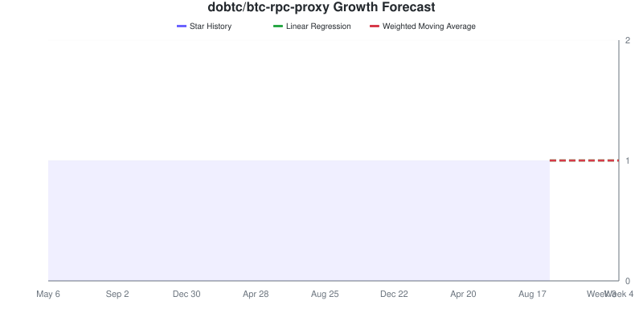

qemus/boot-logo

**qemus/boot-logo**

| Method | Week 1 | Week 2 | Week 3 | Week 4 |
|:---|---:|---:|---:|---:|
| Linear Regression | 1 | 1 | 1 | 1 |
| Weighted Moving Average | 1 | 1 | 1 | 1 |

qemus/qemu-bochs

**qemus/qemu-bochs**

| Method | Week 1 | Week 2 | Week 3 | Week 4 |
|:---|---:|---:|---:|---:|
| Linear Regression | 1 | 1 | 1 | 1 |
| Weighted Moving Average | 1 | 1 | 1 | 1 |

qemus/qemu-helios

**qemus/qemu-helios**

| Method | Week 1 | Week 2 | Week 3 | Week 4 |
|:---|---:|---:|---:|---:|
| Linear Regression | 1 | 1 | 1 | 1 |
| Weighted Moving Average | 1 | 1 | 1 | 1 |

qemus/qemu-render

**qemus/qemu-render**

| Method | Week 1 | Week 2 | Week 3 | Week 4 |
|:---|---:|---:|---:|---:|
| Linear Regression | 1 | 1 | 1 | 1 |
| Weighted Moving Average | 1 | 1 | 1 | 1 |

qemus/qemu-windows

**qemus/qemu-windows**

| Method | Week 1 | Week 2 | Week 3 | Week 4 |
|:---|---:|---:|---:|---:|
| Linear Regression | 1 | 1 | 1 | 1 |
| Weighted Moving Average | 1 | 1 | 1 | 1 |

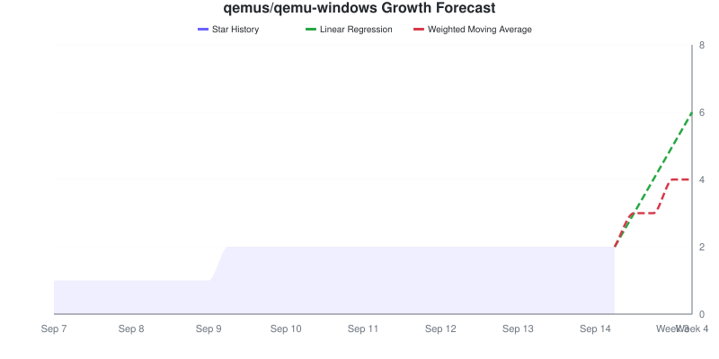

qemus/udfread

**qemus/udfread**

| Method | Week 1 | Week 2 | Week 3 | Week 4 |
|:---|---:|---:|---:|---:|
| Linear Regression | 1 | 1 | 1 | 1 |
| Weighted Moving Average | 1 | 1 | 1 | 1 |

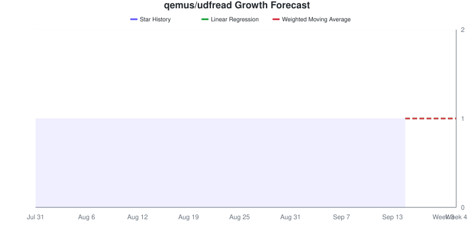

qemus/virtio-drivers

**qemus/virtio-drivers**

| Method | Week 1 | Week 2 | Week 3 | Week 4 |
|:---|---:|---:|---:|---:|
| Linear Regression | 1 | 1 | 1 | 1 |
| Weighted Moving Average | 1 | 1 | 1 | 1 |

qemus/websocketd

**qemus/websocketd**

| Method | Week 1 | Week 2 | Week 3 | Week 4 |
|:---|---:|---:|---:|---:|
| Linear Regression | 1 | 1 | 1 | 1 |
| Weighted Moving Average | 1 | 1 | 1 | 1 |

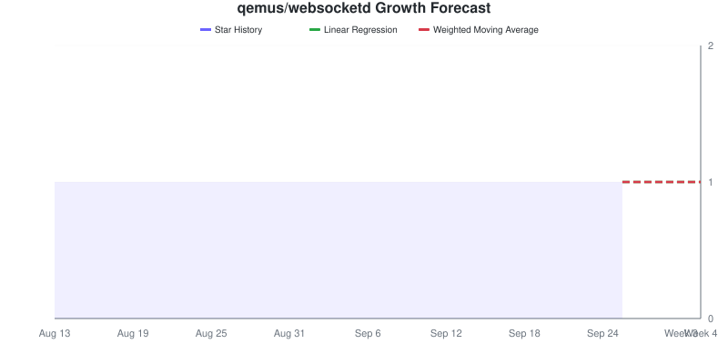

---
*Generated by [GitHub Star Tracker](https://github.com/fbuireu/github-star-tracker) on 2026-09-07T02:45:14.691Z*

*Made with 🤘 by [Ferran Buireu](https://github.com/fbuireu)*

