# Star Tracker Report

**2026-08-01** | Total: **85088 stars** | Change: **+51**

> Compared to snapshot from 2026-07-31

## 📈 Star Trend

### By Repository

Individual Repository Charts

#### dockur/windows

#### dockur/macos

#### vdsm/virtual-dsm

#### dockur/windows-arm

#### qemus/qemu

#### dockur/samba

#### dockur/umbrel

#### dockur/proxmox

#### dockur/casa

#### dockur/tor

#### qemus/qemu-arm

#### dockur/dnsmasq

#### dockur/portainer-backup

#### qemus/virtiso

#### dockur/chrony

#### dockur/statping

#### qemus/virtiso-whql

#### dockur/munin

#### qemus/qemu-host

#### dockur/zima

#### qemus/virtiso-arm

#### dockur/proxmox-backup

#### dockur/strfry

#### dockur/lemmy-ui

#### action-pack/gitlab-sync

#### qemus/virtiso-x86

#### dockur/stunnel

#### dobtc/bitcoin

#### dockur/lemmy

#### dockur/proxmox-dm

#### qemus/passt

#### action-pack/increment

#### dockur/qemu

#### dockur/virtual-dsm

#### action-pack/cancel

#### qemus/proxmox-backup-arm64

#### action-pack/set-secret

#### dockur/chromeos

#### dockur/proxmox-mail

#### dockur/piefed

#### qemus/proxmox-datacenter-arm64

#### action-pack/valid-xml

#### qemus/fiano

#### qemus/proxmox

#### action-pack/set-variable

#### action-pack/tag-exists

#### dockur/bitcoin

#### dockur/mdns

#### qemus/proxmox-mail-arm64

#### action-pack/bump

#### action-pack/github-release

#### action-pack/send-mail

#### dobtc/btc-rpc-proxy

#### qemus/boot-logo

#### qemus/proxmox-backup

#### qemus/proxmox-dm

#### qemus/proxmox-mail

#### qemus/udfread

## Repositories

| Repositories | Stars | Change | Trend |
|:-----------|------:|-------:|:-----:|
| [dockur/windows](https://github.com/dockur/windows) | 52695 | +24 | ⬆️ |
| [dockur/macos](https://github.com/dockur/macos) | 21162 | +18 | ⬆️ |
| [vdsm/virtual-dsm](https://github.com/vdsm/virtual-dsm) | 3936 | +1 | ⬆️ |
| [dockur/windows-arm](https://github.com/dockur/windows-arm) | 2227 | 0 | ➖ |
| [qemus/qemu](https://github.com/qemus/qemu) | 1910 | +1 | ⬆️ |
| [dockur/samba](https://github.com/dockur/samba) | 778 | 0 | ➖ |
| [dockur/umbrel](https://github.com/dockur/umbrel) | 406 | 0 | ➖ |
| [dockur/proxmox](https://github.com/dockur/proxmox) | 280 | 0 | ➖ |
| [dockur/casa](https://github.com/dockur/casa) | 219 | +1 | ⬆️ |
| [dockur/tor](https://github.com/dockur/tor) | 211 | 0 | ➖ |
| [qemus/qemu-arm](https://github.com/qemus/qemu-arm) | 204 | 0 | ➖ |
| [dockur/dnsmasq](https://github.com/dockur/dnsmasq) | 155 | 0 | ➖ |
| [dockur/portainer-backup](https://github.com/dockur/portainer-backup) | 135 | 0 | ➖ |
| [qemus/virtiso](https://github.com/qemus/virtiso) | 128 | 0 | ➖ |
| [dockur/chrony](https://github.com/dockur/chrony) | 111 | 0 | ➖ |
| [dockur/statping](https://github.com/dockur/statping) | 76 | 0 | ➖ |
| [qemus/virtiso-whql](https://github.com/qemus/virtiso-whql) | 61 | 0 | ➖ |
| [dockur/munin](https://github.com/dockur/munin) | 45 | 0 | ➖ |
| [qemus/qemu-host](https://github.com/qemus/qemu-host) | 29 | 0 | ➖ |
| [dockur/zima](https://github.com/dockur/zima) | 27 | 0 | ➖ |
| [qemus/virtiso-arm](https://github.com/qemus/virtiso-arm) | 27 | 0 | ➖ |
| [dockur/proxmox-backup](https://github.com/dockur/proxmox-backup) | 24 | +1 | ⬆️ |
| [dockur/strfry](https://github.com/dockur/strfry) | 23 | 0 | ➖ |
| [dockur/lemmy-ui](https://github.com/dockur/lemmy-ui) | 22 | 0 | ➖ |
| [action-pack/gitlab-sync](https://github.com/action-pack/gitlab-sync) | 20 | 0 | ➖ |
| [qemus/virtiso-x86](https://github.com/qemus/virtiso-x86) | 17 | 0 | ➖ |
| [dockur/stunnel](https://github.com/dockur/stunnel) | 15 | 0 | ➖ |
| [dobtc/bitcoin](https://github.com/dobtc/bitcoin) | 13 | 0 | ➖ |
| [dockur/lemmy](https://github.com/dockur/lemmy) | 13 | 0 | ➖ |
| [dockur/proxmox-dm](https://github.com/dockur/proxmox-dm) | 12 | 0 | ➖ |
| [qemus/passt](https://github.com/qemus/passt) | 11 | 0 | ➖ |
| [action-pack/increment](https://github.com/action-pack/increment) | 9 | 0 | ➖ |
| [dockur/qemu](https://github.com/dockur/qemu) | 9 | 0 | ➖ |
| [dockur/virtual-dsm](https://github.com/dockur/virtual-dsm) | 9 | +1 | ⬆️ |
| [action-pack/cancel](https://github.com/action-pack/cancel) | 8 | 0 | ➖ |
| [qemus/proxmox-backup-arm64](https://github.com/qemus/proxmox-backup-arm64) | 8 | 0 | ➖ |
| [action-pack/set-secret](https://github.com/action-pack/set-secret) | 7 | 0 | ➖ |
| [dockur/chromeos](https://github.com/dockur/chromeos) | 5 | +2 | ⬆️ |
| [dockur/proxmox-mail](https://github.com/dockur/proxmox-mail) | 5 | 0 | ➖ |
| [dockur/piefed](https://github.com/dockur/piefed) | 4 | 0 | ➖ |
| [qemus/proxmox-datacenter-arm64](https://github.com/qemus/proxmox-datacenter-arm64) | 4 | 0 | ➖ |
| [action-pack/valid-xml](https://github.com/action-pack/valid-xml) | 3 | 0 | ➖ |
| [qemus/fiano](https://github.com/qemus/fiano) | 3 | 0 | ➖ |
| [qemus/proxmox](https://github.com/qemus/proxmox) | 3 | 0 | ➖ |
| [action-pack/set-variable](https://github.com/action-pack/set-variable) | 2 | 0 | ➖ |
| [action-pack/tag-exists](https://github.com/action-pack/tag-exists) | 2 | 0 | ➖ |
| [dockur/bitcoin](https://github.com/dockur/bitcoin) | 2 | 0 | ➖ |
| [dockur/mdns](https://github.com/dockur/mdns) | 2 | 0 | ➖ |
| [qemus/proxmox-mail-arm64](https://github.com/qemus/proxmox-mail-arm64) | 2 | 0 | ➖ |
| [action-pack/bump](https://github.com/action-pack/bump) | 1 | 0 | ➖ |
| [action-pack/github-release](https://github.com/action-pack/github-release) | 1 | 0 | ➖ |
| [action-pack/send-mail](https://github.com/action-pack/send-mail) | 1 | 0 | ➖ |
| [dobtc/btc-rpc-proxy](https://github.com/dobtc/btc-rpc-proxy) | 1 | 0 | ➖ |
| [qemus/boot-logo](https://github.com/qemus/boot-logo) `NEW` | 1 | 0 | ➖ |
| [qemus/proxmox-backup](https://github.com/qemus/proxmox-backup) | 1 | 0 | ➖ |
| [qemus/proxmox-dm](https://github.com/qemus/proxmox-dm) | 1 | 0 | ➖ |
| [qemus/proxmox-mail](https://github.com/qemus/proxmox-mail) | 1 | 0 | ➖ |
| [qemus/udfread](https://github.com/qemus/udfread) | 1 | +1 | ⬆️ |

## New Repositories

- [qemus/boot-logo](https://github.com/qemus/boot-logo): 1 stars

## Summary

- **Stars gained:** 50
- **Stars lost:** 0
- **Net change:** +51

## 🔮 Growth Forecast

### 🚀 Growth Velocity

- **Stars per day:** 51.01
- **Growth:** +0.1%
- ~293 days to 100000 ★

**Aggregate Forecast**

| Method | Week 1 | Week 2 | Week 3 | Week 4 |
|:---|---:|---:|---:|---:|
| Linear Regression | 85654 | 86220 | 86785 | 87351 |
| Weighted Moving Average | 85648 | 86208 | 86768 | 87328 |

### By Repository

dockur/windows

**dockur/windows**

| Method | Week 1 | Week 2 | Week 3 | Week 4 |
|:---|---:|---:|---:|---:|
| Linear Regression | 53044 | 53393 | 53742 | 54091 |
| Weighted Moving Average | 53033 | 53371 | 53709 | 54048 |

dockur/macos

**dockur/macos**

| Method | Week 1 | Week 2 | Week 3 | Week 4 |
|:---|---:|---:|---:|---:|
| Linear Regression | 21312 | 21461 | 21611 | 21761 |
| Weighted Moving Average | 21313 | 21464 | 21616 | 21767 |

vdsm/virtual-dsm

**vdsm/virtual-dsm**

| Method | Week 1 | Week 2 | Week 3 | Week 4 |
|:---|---:|---:|---:|---:|
| Linear Regression | 3957 | 3978 | 4000 | 4021 |
| Weighted Moving Average | 3954 | 3971 | 3989 | 4007 |

dockur/windows-arm

**dockur/windows-arm**

| Method | Week 1 | Week 2 | Week 3 | Week 4 |
|:---|---:|---:|---:|---:|
| Linear Regression | 2243 | 2258 | 2274 | 2290 |
| Weighted Moving Average | 2241 | 2255 | 2269 | 2283 |

qemus/qemu

**qemus/qemu**

| Method | Week 1 | Week 2 | Week 3 | Week 4 |
|:---|---:|---:|---:|---:|
| Linear Regression | 1922 | 1934 | 1946 | 1958 |
| Weighted Moving Average | 1924 | 1938 | 1952 | 1966 |

dockur/samba

**dockur/samba**

| Method | Week 1 | Week 2 | Week 3 | Week 4 |
|:---|---:|---:|---:|---:|
| Linear Regression | 783 | 788 | 793 | 798 |
| Weighted Moving Average | 784 | 790 | 796 | 802 |

dockur/umbrel

**dockur/umbrel**

| Method | Week 1 | Week 2 | Week 3 | Week 4 |
|:---|---:|---:|---:|---:|
| Linear Regression | 409 | 412 | 414 | 417 |
| Weighted Moving Average | 409 | 412 | 415 | 418 |

dockur/proxmox

**dockur/proxmox**

| Method | Week 1 | Week 2 | Week 3 | Week 4 |
|:---|---:|---:|---:|---:|
| Linear Regression | 281 | 281 | 282 | 282 |
| Weighted Moving Average | 283 | 286 | 289 | 292 |

dockur/casa

**dockur/casa**

| Method | Week 1 | Week 2 | Week 3 | Week 4 |
|:---|---:|---:|---:|---:|
| Linear Regression | 220 | 222 | 223 | 224 |
| Weighted Moving Average | 221 | 223 | 224 | 226 |

dockur/tor

**dockur/tor**

| Method | Week 1 | Week 2 | Week 3 | Week 4 |
|:---|---:|---:|---:|---:|
| Linear Regression | 212 | 214 | 215 | 216 |
| Weighted Moving Average | 213 | 214 | 216 | 217 |

qemus/qemu-arm

**qemus/qemu-arm**

| Method | Week 1 | Week 2 | Week 3 | Week 4 |
|:---|---:|---:|---:|---:|
| Linear Regression | 205 | 207 | 208 | 210 |
| Weighted Moving Average | 205 | 207 | 208 | 210 |

dockur/dnsmasq

**dockur/dnsmasq**

| Method | Week 1 | Week 2 | Week 3 | Week 4 |
|:---|---:|---:|---:|---:|
| Linear Regression | 156 | 157 | 158 | 159 |
| Weighted Moving Average | 156 | 157 | 159 | 160 |

dockur/portainer-backup

**dockur/portainer-backup**

| Method | Week 1 | Week 2 | Week 3 | Week 4 |
|:---|---:|---:|---:|---:|
| Linear Regression | 136 | 137 | 138 | 139 |
| Weighted Moving Average | 136 | 137 | 138 | 139 |

qemus/virtiso

**qemus/virtiso**

| Method | Week 1 | Week 2 | Week 3 | Week 4 |
|:---|---:|---:|---:|---:|
| Linear Regression | 129 | 129 | 130 | 131 |
| Weighted Moving Average | 129 | 130 | 131 | 132 |

dockur/chrony

**dockur/chrony**

| Method | Week 1 | Week 2 | Week 3 | Week 4 |
|:---|---:|---:|---:|---:|
| Linear Regression | 112 | 112 | 113 | 114 |
| Weighted Moving Average | 112 | 113 | 114 | 114 |

dockur/statping

**dockur/statping**

| Method | Week 1 | Week 2 | Week 3 | Week 4 |
|:---|---:|---:|---:|---:|
| Linear Regression | 77 | 77 | 78 | 78 |
| Weighted Moving Average | 76 | 77 | 77 | 78 |

qemus/virtiso-whql

**qemus/virtiso-whql**

| Method | Week 1 | Week 2 | Week 3 | Week 4 |
|:---|---:|---:|---:|---:|
| Linear Regression | 61 | 62 | 62 | 62 |
| Weighted Moving Average | 62 | 62 | 63 | 63 |

dockur/munin

**dockur/munin**

| Method | Week 1 | Week 2 | Week 3 | Week 4 |
|:---|---:|---:|---:|---:|
| Linear Regression | 45 | 46 | 46 | 46 |
| Weighted Moving Average | 45 | 46 | 46 | 46 |

qemus/qemu-host

**qemus/qemu-host**

| Method | Week 1 | Week 2 | Week 3 | Week 4 |
|:---|---:|---:|---:|---:|
| Linear Regression | 29 | 29 | 30 | 30 |
| Weighted Moving Average | 29 | 29 | 30 | 30 |

dockur/zima

**dockur/zima**

| Method | Week 1 | Week 2 | Week 3 | Week 4 |
|:---|---:|---:|---:|---:|
| Linear Regression | 27 | 27 | 27 | 27 |
| Weighted Moving Average | 27 | 28 | 28 | 28 |

qemus/virtiso-arm

**qemus/virtiso-arm**

| Method | Week 1 | Week 2 | Week 3 | Week 4 |
|:---|---:|---:|---:|---:|
| Linear Regression | 27 | 27 | 27 | 28 |
| Weighted Moving Average | 27 | 27 | 28 | 28 |

dockur/proxmox-backup

**dockur/proxmox-backup**

| Method | Week 1 | Week 2 | Week 3 | Week 4 |
|:---|---:|---:|---:|---:|
| Linear Regression | 24 | 24 | 24 | 24 |
| Weighted Moving Average | 24 | 25 | 25 | 25 |

dockur/strfry

**dockur/strfry**

| Method | Week 1 | Week 2 | Week 3 | Week 4 |
|:---|---:|---:|---:|---:|
| Linear Regression | 23 | 23 | 23 | 24 |
| Weighted Moving Average | 23 | 23 | 23 | 24 |

dockur/lemmy-ui

**dockur/lemmy-ui**

| Method | Week 1 | Week 2 | Week 3 | Week 4 |
|:---|---:|---:|---:|---:|
| Linear Regression | 22 | 22 | 22 | 23 |
| Weighted Moving Average | 22 | 22 | 22 | 23 |

action-pack/gitlab-sync

**action-pack/gitlab-sync**

| Method | Week 1 | Week 2 | Week 3 | Week 4 |
|:---|---:|---:|---:|---:|
| Linear Regression | 20 | 20 | 20 | 20 |
| Weighted Moving Average | 20 | 20 | 20 | 20 |

qemus/virtiso-x86

**qemus/virtiso-x86**

| Method | Week 1 | Week 2 | Week 3 | Week 4 |
|:---|---:|---:|---:|---:|
| Linear Regression | 17 | 17 | 17 | 17 |
| Weighted Moving Average | 17 | 17 | 17 | 17 |

dockur/stunnel

**dockur/stunnel**

| Method | Week 1 | Week 2 | Week 3 | Week 4 |
|:---|---:|---:|---:|---:|
| Linear Regression | 15 | 15 | 15 | 15 |
| Weighted Moving Average | 15 | 15 | 15 | 16 |

dobtc/bitcoin

**dobtc/bitcoin**

| Method | Week 1 | Week 2 | Week 3 | Week 4 |
|:---|---:|---:|---:|---:|
| Linear Regression | 13 | 13 | 13 | 13 |
| Weighted Moving Average | 13 | 13 | 13 | 13 |

dockur/lemmy

**dockur/lemmy**

| Method | Week 1 | Week 2 | Week 3 | Week 4 |
|:---|---:|---:|---:|---:|
| Linear Regression | 13 | 13 | 13 | 13 |
| Weighted Moving Average | 13 | 13 | 13 | 13 |

dockur/proxmox-dm

**dockur/proxmox-dm**

| Method | Week 1 | Week 2 | Week 3 | Week 4 |
|:---|---:|---:|---:|---:|
| Linear Regression | 12 | 12 | 12 | 12 |
| Weighted Moving Average | 12 | 12 | 12 | 13 |

qemus/passt

**qemus/passt**

| Method | Week 1 | Week 2 | Week 3 | Week 4 |
|:---|---:|---:|---:|---:|
| Linear Regression | 11 | 11 | 11 | 11 |
| Weighted Moving Average | 11 | 11 | 11 | 11 |

action-pack/increment

**action-pack/increment**

| Method | Week 1 | Week 2 | Week 3 | Week 4 |
|:---|---:|---:|---:|---:|
| Linear Regression | 9 | 9 | 9 | 9 |
| Weighted Moving Average | 9 | 9 | 9 | 9 |

dockur/qemu

**dockur/qemu**

| Method | Week 1 | Week 2 | Week 3 | Week 4 |
|:---|---:|---:|---:|---:|
| Linear Regression | 9 | 9 | 9 | 9 |
| Weighted Moving Average | 9 | 9 | 9 | 9 |

dockur/virtual-dsm

**dockur/virtual-dsm**

| Method | Week 1 | Week 2 | Week 3 | Week 4 |
|:---|---:|---:|---:|---:|
| Linear Regression | 9 | 9 | 9 | 9 |
| Weighted Moving Average | 9 | 9 | 9 | 9 |

action-pack/cancel

**action-pack/cancel**

| Method | Week 1 | Week 2 | Week 3 | Week 4 |
|:---|---:|---:|---:|---:|
| Linear Regression | 8 | 8 | 8 | 8 |
| Weighted Moving Average | 8 | 8 | 8 | 8 |

qemus/proxmox-backup-arm64

**qemus/proxmox-backup-arm64**

| Method | Week 1 | Week 2 | Week 3 | Week 4 |
|:---|---:|---:|---:|---:|
| Linear Regression | 8 | 8 | 8 | 8 |
| Weighted Moving Average | 8 | 8 | 8 | 8 |

action-pack/set-secret

**action-pack/set-secret**

| Method | Week 1 | Week 2 | Week 3 | Week 4 |
|:---|---:|---:|---:|---:|
| Linear Regression | 7 | 7 | 7 | 7 |
| Weighted Moving Average | 7 | 7 | 7 | 7 |

dockur/chromeos

**dockur/chromeos**

| Method | Week 1 | Week 2 | Week 3 | Week 4 |
|:---|---:|---:|---:|---:|
| Linear Regression | 5 | 5 | 5 | 5 |
| Weighted Moving Average | 5 | 5 | 5 | 5 |

dockur/proxmox-mail

**dockur/proxmox-mail**

| Method | Week 1 | Week 2 | Week 3 | Week 4 |
|:---|---:|---:|---:|---:|
| Linear Regression | 5 | 5 | 5 | 5 |
| Weighted Moving Average | 5 | 5 | 5 | 5 |

dockur/piefed

**dockur/piefed**

| Method | Week 1 | Week 2 | Week 3 | Week 4 |
|:---|---:|---:|---:|---:|
| Linear Regression | 4 | 4 | 4 | 4 |
| Weighted Moving Average | 4 | 4 | 4 | 4 |

qemus/proxmox-datacenter-arm64

**qemus/proxmox-datacenter-arm64**

| Method | Week 1 | Week 2 | Week 3 | Week 4 |
|:---|---:|---:|---:|---:|
| Linear Regression | 4 | 4 | 4 | 4 |
| Weighted Moving Average | 4 | 4 | 4 | 4 |

action-pack/valid-xml

**action-pack/valid-xml**

| Method | Week 1 | Week 2 | Week 3 | Week 4 |
|:---|---:|---:|---:|---:|
| Linear Regression | 3 | 3 | 3 | 3 |
| Weighted Moving Average | 3 | 3 | 3 | 3 |

qemus/fiano

**qemus/fiano**

| Method | Week 1 | Week 2 | Week 3 | Week 4 |
|:---|---:|---:|---:|---:|
| Linear Regression | 3 | 3 | 3 | 3 |
| Weighted Moving Average | 3 | 3 | 3 | 3 |

qemus/proxmox

**qemus/proxmox**

| Method | Week 1 | Week 2 | Week 3 | Week 4 |
|:---|---:|---:|---:|---:|
| Linear Regression | 3 | 3 | 3 | 3 |
| Weighted Moving Average | 3 | 3 | 3 | 3 |

action-pack/set-variable

**action-pack/set-variable**

| Method | Week 1 | Week 2 | Week 3 | Week 4 |
|:---|---:|---:|---:|---:|
| Linear Regression | 2 | 2 | 2 | 2 |
| Weighted Moving Average | 2 | 2 | 2 | 2 |

action-pack/tag-exists

**action-pack/tag-exists**

| Method | Week 1 | Week 2 | Week 3 | Week 4 |
|:---|---:|---:|---:|---:|
| Linear Regression | 2 | 2 | 2 | 2 |
| Weighted Moving Average | 2 | 2 | 2 | 2 |

dockur/bitcoin

**dockur/bitcoin**

| Method | Week 1 | Week 2 | Week 3 | Week 4 |
|:---|---:|---:|---:|---:|
| Linear Regression | 2 | 2 | 2 | 2 |
| Weighted Moving Average | 2 | 2 | 2 | 2 |

dockur/mdns

**dockur/mdns**

| Method | Week 1 | Week 2 | Week 3 | Week 4 |
|:---|---:|---:|---:|---:|
| Linear Regression | 2 | 2 | 2 | 2 |
| Weighted Moving Average | 2 | 2 | 2 | 2 |

qemus/proxmox-mail-arm64

**qemus/proxmox-mail-arm64**

| Method | Week 1 | Week 2 | Week 3 | Week 4 |
|:---|---:|---:|---:|---:|
| Linear Regression | 2 | 2 | 2 | 2 |
| Weighted Moving Average | 2 | 2 | 2 | 2 |

action-pack/bump

**action-pack/bump**

| Method | Week 1 | Week 2 | Week 3 | Week 4 |
|:---|---:|---:|---:|---:|
| Linear Regression | 1 | 1 | 1 | 1 |
| Weighted Moving Average | 1 | 1 | 1 | 1 |

action-pack/github-release

**action-pack/github-release**

| Method | Week 1 | Week 2 | Week 3 | Week 4 |
|:---|---:|---:|---:|---:|
| Linear Regression | 1 | 1 | 1 | 1 |
| Weighted Moving Average | 1 | 1 | 1 | 1 |

action-pack/send-mail

**action-pack/send-mail**

| Method | Week 1 | Week 2 | Week 3 | Week 4 |
|:---|---:|---:|---:|---:|
| Linear Regression | 1 | 1 | 1 | 1 |
| Weighted Moving Average | 1 | 1 | 1 | 1 |

dobtc/btc-rpc-proxy

**dobtc/btc-rpc-proxy**

| Method | Week 1 | Week 2 | Week 3 | Week 4 |
|:---|---:|---:|---:|---:|
| Linear Regression | 1 | 1 | 1 | 1 |
| Weighted Moving Average | 1 | 1 | 1 | 1 |

qemus/boot-logo

**qemus/boot-logo**

| Method | Week 1 | Week 2 | Week 3 | Week 4 |
|:---|---:|---:|---:|---:|
| Linear Regression | 1 | 1 | 1 | 1 |
| Weighted Moving Average | 1 | 1 | 1 | 1 |

qemus/proxmox-backup

**qemus/proxmox-backup**

| Method | Week 1 | Week 2 | Week 3 | Week 4 |
|:---|---:|---:|---:|---:|
| Linear Regression | 1 | 1 | 1 | 1 |
| Weighted Moving Average | 1 | 1 | 1 | 1 |

qemus/proxmox-dm

**qemus/proxmox-dm**

| Method | Week 1 | Week 2 | Week 3 | Week 4 |
|:---|---:|---:|---:|---:|
| Linear Regression | 1 | 1 | 1 | 1 |
| Weighted Moving Average | 1 | 1 | 1 | 1 |

qemus/proxmox-mail

**qemus/proxmox-mail**

| Method | Week 1 | Week 2 | Week 3 | Week 4 |
|:---|---:|---:|---:|---:|
| Linear Regression | 1 | 1 | 1 | 1 |
| Weighted Moving Average | 1 | 1 | 1 | 1 |

qemus/udfread

**qemus/udfread**

| Method | Week 1 | Week 2 | Week 3 | Week 4 |
|:---|---:|---:|---:|---:|
| Linear Regression | 1 | 1 | 1 | 1 |
| Weighted Moving Average | 1 | 1 | 1 | 1 |

---
*Generated by [GitHub Star Tracker](https://github.com/fbuireu/github-star-tracker) on 2026-08-01T02:32:01.304Z*

*Made with 🤘 by [Ferran Buireu](https://github.com/fbuireu)*

